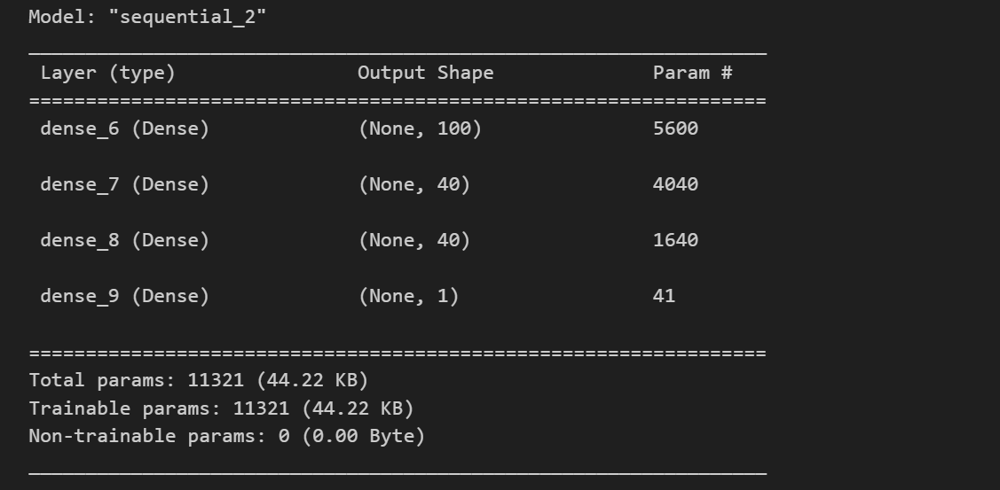
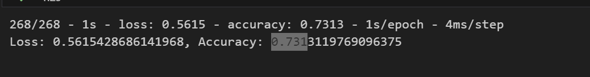

# deep-learning-challenge
## Overview of the Analysis

In this section, describe the analysis you completed in this Challenge.

This analysis has the purpose of designing a neural network with the purpose of prediciting if a funded project will be succesful, we have a csv file with helpful information on previous funded projects that will help to train our model in orther to make predictions of the outcome. 

First, we had to process the given data, in this step we indentied that our targetn data is the column "Is succesful" wich is a binary number that gave us the information whether the project was succesful or not. Then, we bin some date into the category "Other" for an easier understanding of the data.

For the second step we designed a neural network using Tensorflow to make the predictions and then we evaluated the model.
For the third step we tried to optimize the model to achieve a target predictive accuracy, in order to achivie this level of accuracy this is what we have done:
-Reducing the cutoff value for the application type "other bean", we made this to decrease the data that was lost in this process.
-Reducing the cutoff value for the classification "other bean", we made this to decrease the data that was lost in this process.
-Changing the function to "tanh"
-Adding hidden nodes, and adding another hidden layer

## Results

Using bulleted lists and images to support your answers, address the following questions:

* Data Preprocessing:
  * What variable(s) are the target(s) for your model?
  The columns "Is succesful"
  * What variable(s) are the features for your model?
  The other columns, except for "EIN","NAME" columns
  * What variable(s) should be removed from the input data because they are neither targets nor features?
  "EIN","NAME" 
* Compiling, Training, and Evaluating the Model
  * How many neurons, layers, and activation functions did you select for your neural network model, and why?
    *4 layers
    *First hidden layers: 100 neuron units, "tanh" function.
    *second and third hidden layer: 40 neuron units "tanh" function.
    *fourth hidden layer: 1 neuron units "sigmoid" function.
  * Were you able to achieve the target model performance?
  No, i get to 0.73 accuracy.
  
  
  * What steps did you take in your attempts to increase model performance?

    -Reducing the cutoff value for the application type "other bean" to 20, we made this to decrease the data that was lost in this process.
    
    -Reducing the cutoff value for the classification "other bean" to 50, we made this to decrease the data that was lost in this process.
    
    -Changing the activation function of the first, second and third hidden layers to "tanh"
    
    -Adding hidden nodes (hidden_nodes_layer1 =  100 ,hidden_nodes_layer2 = 40), and adding another hidden layer.x|

## Summary

* Summarize the overall results of the deep learning model. Include a recommendation for how a different model could solve this classification problem, and then explain your recommendation.
-This model achieve an accuracy of 0.73 after the optimization, i recommend to desing a model that let kernel to decide the activation function, number of neurons and the number of hidden layers, this way we will have the most accurate possible model. 

